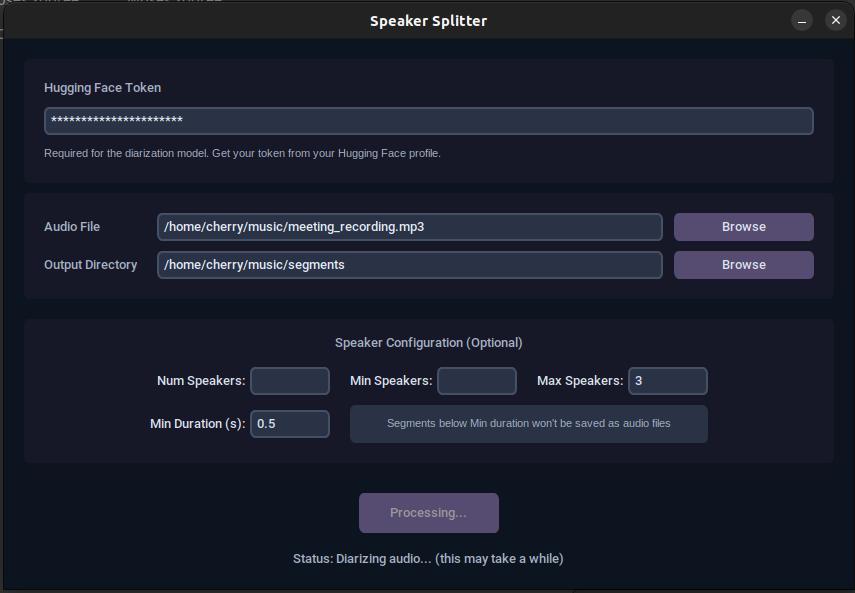

# Speaker Splitter

This tool harnesses a powerful, pre-trained, state-of-the-art model to automatically split a single audio file by speaker. It analyzes the conversation, determines every speaker's segments, and exports them into clean, organized folders, turning a mixed dialogue into a structured dataset with just a few clicks.

## Features

-   Simple and intuitive graphical interface.
-   Uses pre-trained model [`pyannote/speaker-diarization-3.1`](https://huggingface.co/pyannote/speaker-diarization-3.1).
-   Allows specifying the exact, minimum, or maximum number of speakers.
-   Organizes the output audio clips into folders named by speaker ID.
-   Filters out very short audio segments to reduce noise.

## Prerequisites

Before you begin, ensure you have the following installed on your system:

1.  **Python 3.8+**
2.  **FFmpeg**: The `pydub` library requires FFmpeg to process audio files.

    -   **On macOS (using Homebrew):**
        ```bash
        brew install ffmpeg
        ```
    -   **On Linux (Debian/Ubuntu):**
        ```bash
        sudo apt update && sudo apt install ffmpeg
        ```

3.  **Hugging Face Account & Token**: The diarization model is gated and requires a Hugging Face user access token to download.

    ---
    ### Step 1: Accept Model's Terms of Use

    You **MUST** accept the user conditions for the pyannote model first. If you skip this, you will get an access error.

    1.  Go to the model's page on your browser:
        [https://huggingface.co/pyannote/speaker-diarization-3.1](https://huggingface.co/pyannote/speaker-diarization-3.1)

    2.  Log in with your Hugging Face account.

    3.  Read the terms and click "Agree and access repository".

    ---
    ### Step 2: Get Your Access Token

    1.  After accepting the terms, go to your Hugging Face settings page for tokens:
        [https://huggingface.co/settings/tokens](https://huggingface.co/settings/tokens)

    2.  Click on "New token".

    3.  Give it a **Name** (e.g., "speaker_splitter_app") and select the **"read"** Role.

    4.  Click "Generate a token".

    5.  Copy the generated token (it starts with `hf_`) and paste it into the application.

    ---

## Installation & Setup

It is highly recommended to run this project in a virtual environment.

1.  **Clone the repository:**
    ```bash
    git clone <your-repo-url>
    cd speaker-splitter
    ```

2.  **Create and activate a virtual environment:**
    ```bash
    python3 -m venv venv
    source venv/bin/activate
    ```
    *On Windows, activation is `venv\Scripts\activate`*

3.  **Install the required dependencies:**
    ```bash
    pip install -r requirements.txt
    ```
>**Note:** This download can be large (several GBs), but it only happens once.

## How to Run

With your virtual environment activated, simply run the `main.py` script:

```bash
python main.py
```

## How to Use the Application

1.  **Paste Hugging Face Token**: Enter your copied Hugging Face access token in the first input field.
2.  **Select Audio File**: Click "Browse" to choose the audio file you want to process.
3.  **Select Output Directory**: Click "Browse" to choose a folder where the segmented audio clips will be saved.
4.  **Configure Speaker Options (Optional)**:
    -   **Num Speakers**: If you know the exact number of speakers in the audio.
    -   **Min/Max Speakers**: To provide a range for the model to work within.
    -   **Min Duration (s)**: Segments shorter than this value (in seconds) will not be saved. This is useful for ignoring brief noises.
5.  **Start Processing**: Click the "Split Audio" button.
6.  **Wait**: The process involves two main steps: diarization and splitting. The diarization part can be time-consuming, especially for long audio files. The status label will update you on the progress.
7.  **Done**: Once finished, a confirmation message will appear, and you can find your audio clips in the output directory you selected.

### Important Note for Windows Users

This application is primarily developed and tested on **Linux and macOS**. While the libraries may work on Windows, `pyannote.audio` and its dependencies are better supported on Unix-like systems. You may encounter installation or runtime issues on Windows that are outside the scope of this guide.